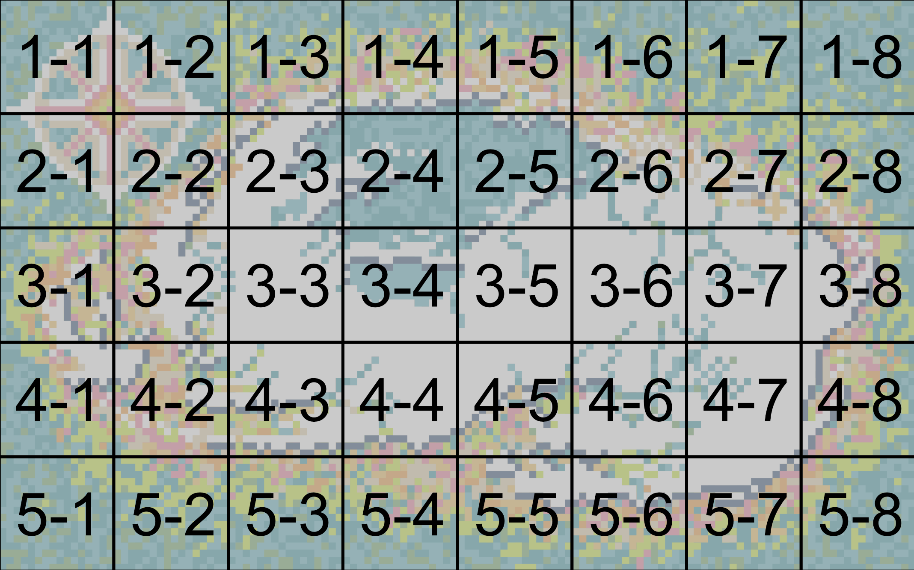

# Lego Roshar Map

This is a fully Lego mosaic of Roshar, the world in which Brandon Sanderson's Stormlight Archive book series takes place. The original map was designed by [Isaac Stewart](https://www.isaacstewart.com/maps-design-1) who does most of the maps for Brandon Sanderson. The landmass was modeled after a mathematical concept called a [fractal](https://en.wikipedia.org/wiki/Fractal), specifically a [Julia Set](https://en.wikipedia.org/wiki/Julia_Set).

A picture of the final version is shown below followed by the full digital version.

The full art piece stretches 26"(65cm) tall by 41"(104cm) with a total element count of 10,240 parts just in the mosaic alone and over 11,000 with the frame.

## You can make this yourself!

This was designed around the official Lego set [#31203 Lego Art World Map](https://www.lego.com/en-us/product/world-map-31203). It can be fully recreated using the provided instructions using only the elements included in that set.

The instructions are broken up into **40 16x16 tiles**. Each `.png` image in the `\Instructions` folder is names using that specific row and column number. For example, the first tile's image is named `1-1.png` and the second tile in and three down is `3-2.png`. Each set of 8 tiles per row is in a separate folder. This means that the first tile's image is located at `LegoRosharMap\Instructions\Row1\1-1.png`. The correct location of each tile can be referenced at any time using the `Legend.png` image shown below. 

### Customize

I used Affinity Designer and Affinity Photo to create the digital portion of this build. I've included the source files from Designer as well as an exported `.pst` version for Adobe Photoshop\Illustrator and a `.pdf` version with layer information for use in whatever other editing application you with to use.

## How do I use GitHub?

If you are a github veteran then go ahead and clone this repo however you prefer. For those who are new to Github and just want to download the instructions to create your own Roshar map it's very simple:

- Click on the `green` button top right labeled `Code`
- Click `Download ZIP`
- Unzip folder after downloading
- Commence building!
